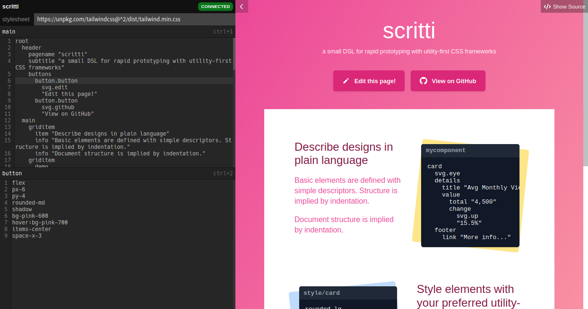
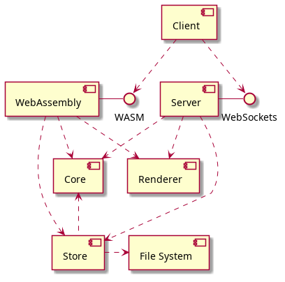
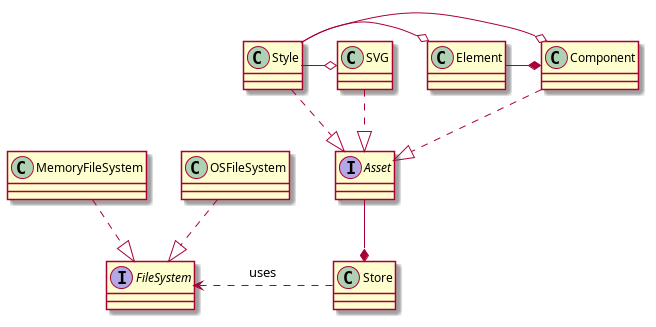

# scritti

A small DSL for rapid prototyping with utility-first CSS frameworks. Inspired by the likes of [pug](https://pugjs.org), [haml](https://haml.info/)

Try it live [here!](https://turnerdev.github.io/scritti/)



## Project Background
Demo project with the goal of exploring concurrency in Go. Features:

* Local dev server (WebSockets, JSON RPC)
* WebAssembly build for client-side parsing
* Simple Web Components based in-browser IDE

### Design



## Installation
Todo: Standalone install steps

```
git clone https://github.com/turnerdev/scritti.
```

## Usage
Todo: Configurable port and base directory

```
mkdir sampledata
go run .
```

## License
[MIT](https://choosealicense.com/licenses/mit/)